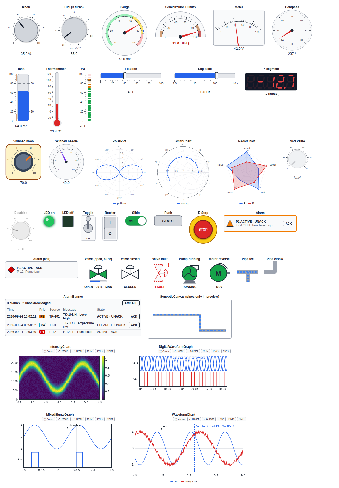

# anywidget-instruments

Instrumentation widgets for computational notebooks: knobs, gauges,
meters, tanks, thermometers, LEDs, switches, push buttons with mechanical
actions, emergency stop, real-time strip charts and alarm annunciators.

The widgets are built on [anywidget](https://anywidget.dev). They work in
JupyterLab, Jupyter Notebook 7, VS Code, Google Colab and marimo, and you don't
need a JavaScript toolchain to use them.

> **Status: pre-alpha (0.1.0.dev0).** The project follows the
> [specification](https://gist.github.com/s-celles/3343599158e4742e543ced320aa12743)
> (EARS requirements). [`docs/requirements-status.md`](docs/requirements-status.md)
> lists which requirements are implemented.

## Install

```bash
pip install anywidget-instruments            # when released
pip install "anywidget-instruments[units]"   # + pint support
```

From source:

```bash
npm install && npm run build   # bundles the front end into src/anywidget_instruments/static
pip install -e ".[dev]"
```

## Quick start

```python
import anywidget_instruments as ai

gain = ai.Knob(2.5, min=0, max=10, step=0.1, unit="dB", label="Gain")
level = ai.Tank(1.2, min=0, max=5, unit="m", lo=0.5, hi=4.5, show_limits=True, label="Level")
run = ai.ToggleSwitch(label="Run")
stop = ai.EmergencyStop(label="E-Stop")


@gain.on_change
def _(change):
    level.value = change["new"] / 2


ai.Panel([gain, level, run, stop], columns=4)
```

Every widget has:

* a synchronized `value`
* a `mode` trait, either `"control"` (the user sets the value) or `"indicator"` (display only)
* `label`, `tooltip`, `disabled`, `visible`, `size` and `style` traits

Numeric widgets add `min`, `max`, `step`, `unit`, `scale` (`linear`/`log`), `ticks`,
`format` (`%.2f`, `%.3e`, `%.3n` engineering, `%.3s` SI prefix), `coerce`,
alarm limits `lolo`/`lo`/`hi`/`hihi` with `deadband`, and the computed
`alarm_level`.

### Mechanical actions and latches

```python
start = ai.PushButton(text="START", mechanical_action="latch_when_released")

# in your acquisition / simulation loop
if start.read_latched():  # True once per click, then the button resets
    begin_sequence()
```

The Boolean controls support six mechanical actions: `switch_when_pressed`,
`switch_when_released`, `switch_until_released`, `latch_when_pressed`,
`latch_when_released` and `latch_until_released`. With `latch_timeout`, an
unread latch expires and triggers `on_latch_expired` callbacks.

### Real-time chart

```python
import numpy as np

chart = ai.WaveformChart(
    n_traces=2,
    history=2000,
    update_mode="strip",
    dt=1e-3,
    x_unit="s",
    traces=[{"name": "setpoint"}, {"name": "measure"}],
    autoscale_y=True,
)
chart.append(np.column_stack([sp, pv]))  # (n_points, n_traces), sent as binary float32
```

`update_mode` is `"strip"` (scrolling), `"scope"` (clear at the right edge) or
`"sweep"` (a moving cursor overwrites old data). While `paused`, the chart keeps
buffering. On the frozen display, the mouse wheel zooms and a drag pans; a
double-click restores the full view.

### Units and engineering scaling

```python
t = ai.Thermometer(unit="degC")
t.value = ureg.Quantity(300, "kelvin")  # pint quantities are converted (26.85 °C)

p = ai.Gauge(unit="bar", max=10, raw_min=4, raw_max=20, eng_min=0, eng_max=10)
p.set_raw(12.0)  # 4-20 mA -> 5 bar
```

### Styles and theming

`style` is `"modern"`, `"classic"` or `"system"`. The `system` style follows the
host colors, including dark mode. `ai.set_default_style("classic")` changes the
default style for widgets created afterwards. Every color is a CSS custom property
scoped to `.awi-root` (for example `--awi-fill`, `--awi-needle`,
`--awi-alarm-hi`), so you can override it per page or per widget.

### marimo

```python
import marimo as mo

knob = mo.ui.anywidget(ai.Knob(label="Gain"))
knob  # other cells that read knob.value re-run when it changes
```

## Widget catalog

| Group | Widgets |
|---|---|
| Numeric | `Knob`, `Dial`, `Gauge`, `Meter`, `VUMeter`, `Tank`, `Thermometer`, `FillSlide`, `SevenSegment`, `Compass` |
| Boolean | `LED`, `ToggleSwitch`, `RockerSwitch`, `SlideSwitch`, `PushButton`, `EmergencyStop` |
| Graphs | `WaveformChart`, `IntensityChart`, `DigitalWaveformGraph`, `MixedSignalGraph` (cursors, zoom, annotations, CSV/PNG/SVG export) |
| Displays | `PolarPlot`, `SmithChart`, `RadarChart`, `PictureControl` |
| Supervisory | `Valve`, `Pump`, `Motor` (faceplates), `Pipe`, `AlarmIndicator`, `AlarmBanner`, `SynopticCanvas` |
| Layout | `Panel` (a grid built on ipywidgets `GridBox`, with `to_dict()` / `from_dict()`) |



If the kernel is restarted or lost, the widgets show a **STALE** badge and
reject input. A notebook reopened without its kernel shows the saved values
as read-only (see `docs/hosts.md`).

Documentation (MkDocs): `pip install -e ".[docs]" && mkdocs serve`. It
includes a getting-started guide, the widget catalog, the API reference, the
[alarm conventions](docs/alarm-conventions.md) and the
[requirements status](docs/requirements-status.md).

Example panels in `examples/`: the gallery, **PID tuning** of a first-order
process, **tank level supervision** with alarms, and **real-time signal
acquisition**.

## Development

```bash
npm install
npm run build              # front-end bundle (esbuild, js/build.mjs)
npm test                   # front-end unit tests (vitest), including the WCAG contrast audit
npm run lint               # eslint, including the SEC-001 rules (no eval / innerHTML)
npm run check:reproducible # byte-identical rebuild (SEC-004)
pip install -e ".[dev]"
pytest                     # Python unit tests + headless execution of the example notebooks
ruff check . && mypy src
npx playwright test        # end-to-end: JupyterLab, Notebook 7, marimo, every widget,
                           # performance benchmarks, visual regression, saved state
```

After an intended visual change, refresh the screenshot baselines with
`npx playwright test e2e/visual.spec.js --update-snapshots`.

`js/preview/index.html` renders every widget with an in-memory model. To use it, run
`python -m http.server` at the repository root and open
`http://localhost:8000/js/preview/index.html`. Add `?style=classic` or
`?style=system&dark` to switch styles.

## License

MIT
