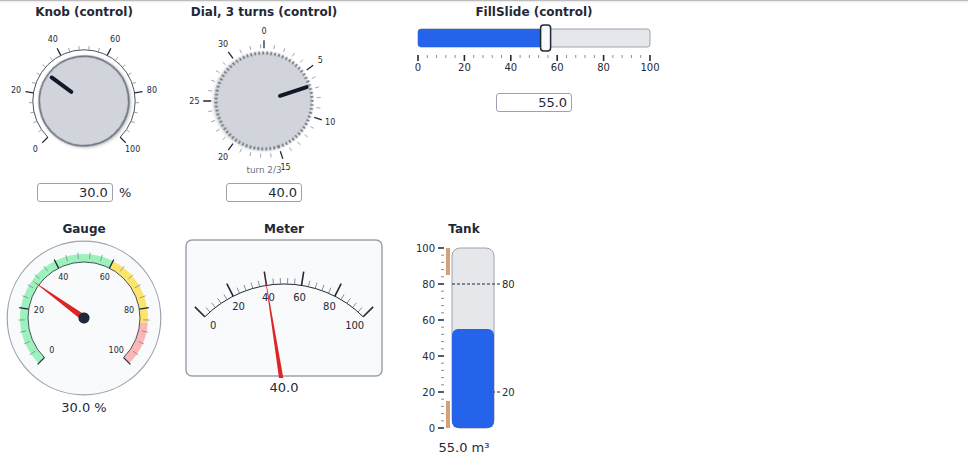
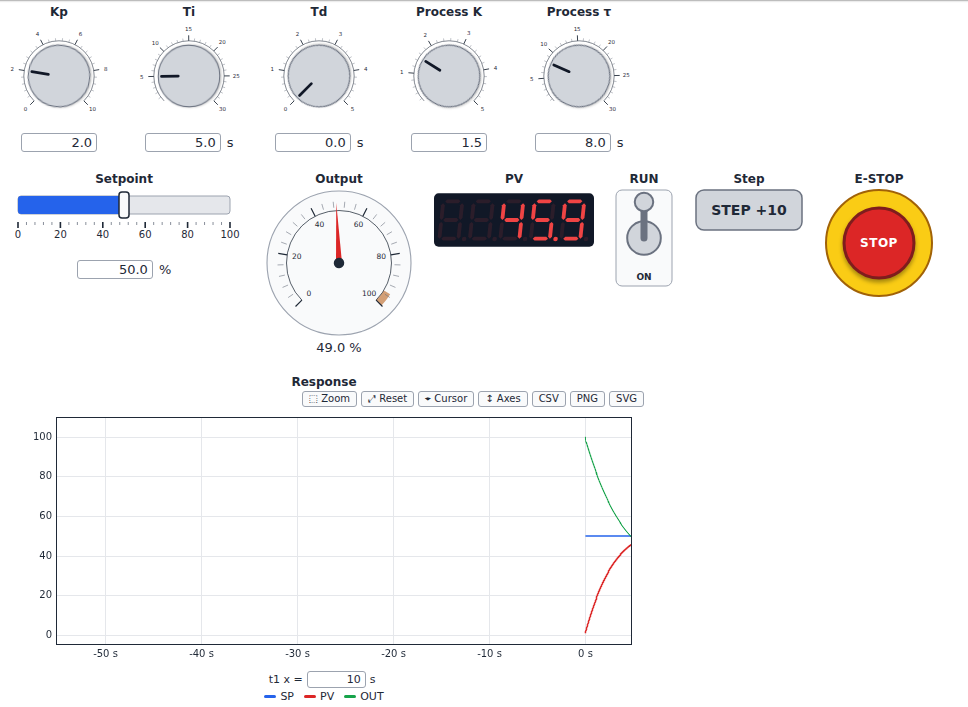
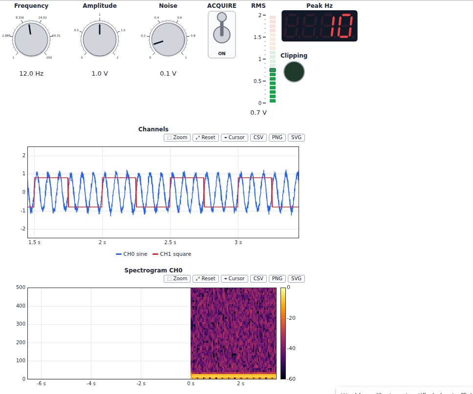

# Examples

!!! note
    The demos and examples simulate processes and machines; they are not
    meant to control real equipment (see the [safety notice](safety.md)).

!!! example "Start with the showcase"
    [**Batch reactor R-101**](showcase.md): a complete operator station on a
    simulated reactor (PackML state machine, recipe, PID faceplate, alarms,
    trends, event log, plant model), the same in marimo, in JupyterLite and,
    from Julia, in KaimonSlate.jl. It opens the table below.

## Run them in your browser

Start here: nothing to install. Each demo is a **reactive notebook**
([marimo](https://marimo.io)) running in your browser: move a control and
the cells that depend on it run again. Each demo is also available as a
JupyterLite notebook. The first load downloads the Python runtime and takes
a few seconds (see [Try it in the browser](try.md)).

The References column names the standards and methods a demo illustrates.
They inspired the widgets; the library does not claim conformity with them
(see [Standards and references](standards.md)).

| Sector | Reactive notebook (marimo) | What it shows | References | Also in JupyterLite |
|---|---|---|---|---|
| Chemical and process control (showcase) | <a href="../marimo/batch_reactor/">**Batch reactor R-101**</a> | A complete operator station: PackML state machine, editable recipe, PID faceplate, valves, pumps, agitator, alarms, trend, event log, plant model; a fault to simulate | ISA-TR88.00.02 (PackML), ISA-88 / IEC 61512-1 (recipe), ISA-101, ISA-18.2 / IEC 62682, IEC 60073, IEC 62264 | <a href="../lite/lab/index.html?path=batch_reactor.ipynb">notebook</a> |
| All sectors (tour) | <a href="../marimo/gallery/">**Gallery**</a> | Every widget family: knobs and indicators, Boolean controls, charts, alarms, styles | IEC 60073 (lamp colors) | <a href="../lite/lab/index.html?path=gallery.ipynb">notebook</a> |
| Water and wastewater | <a href="../marimo/lift_station/">**Lift station**</a> | Wet well with duty / standby pumps, alternation, level alarms, a pump trip and its reset | ISA-18.2 / IEC 62682 (alarm list), ISA-5.1 (tags, pump symbol), IEC 60073 | <a href="../lite/lab/index.html?path=lift_station.ipynb">notebook</a> |
| Chemical and process control | <a href="../marimo/pid_tuning/">**PID tuning**</a> | Closed-loop step response of a process with dead time; overshoot and settling time follow the Kp, Ti, Td knobs | ISA-101 (analog indicator) | <a href="../lite/lab/index.html?path=pid_tuning.ipynb">notebook</a> |
| Food, beverage and packaging | <a href="../marimo/operator_station/">**Operator station**</a> | Filling line following the machine state model, with stack light, PID faceplate, annunciator and alarm list | ISA-TR88.00.02 (PackML states), ISA-18.1 (annunciator), ISA-18.2 / IEC 62682 (alarm list), ISA-101 (faceplate), IEC 60073 (stack light) | <a href="../lite/lab/index.html?path=operator_station.ipynb">notebook</a> |
| Laboratory, test and measurement | <a href="../marimo/signal_analysis/">**Signal analysis**</a> | Waveform selector, frequency and noise knobs; signal, spectrum, RMS level and dominant frequency | SI prefixes (units) | <a href="../lite/lab/index.html?path=signal_analysis.ipynb">notebook</a> |
| Laboratory, test and measurement | <a href="../marimo/virtual_instrument/">**Virtual instrument bench**</a> | Function generator, oscilloscope and multimeter front panels built from widgets | SI prefixes (units) | <a href="../lite/lab/index.html?path=virtual_instrument.ipynb">notebook</a> |
| Machines and processes (methods) | <a href="../marimo/operating_modes/">**Operating modes**</a> | GEMMA, ISA-88 and PackML state models side by side; choosing a situation drives the three models to it through their own commands | GEMMA (ADEPA, 1981), ISA-88 / IEC 61512-1 (procedural states), ISA-TR88.00.02 (PackML states) | <a href="../lite/lab/index.html?path=operating_modes.ipynb">notebook</a> |
| Machine panels | <a href="../marimo/svg_faceplates/">**SVG faceplates**</a> | Front panels drawn in a vector editor and animated from Python: a tank with FILL / DRAIN push buttons, a HAND / AUTO selector, a pilot lamp, a voltmeter and a pressure gauge | | <a href="../lite/lab/index.html?path=svg_faceplates.ipynb">notebook</a> |
| Machine panels | <a href="../marimo/push_buttons/">**Push buttons**</a> | Plain push buttons (latch, jog) and illuminated push buttons whose lamps show the machine state | IEC 60073 (cap and lamp colors) | <a href="../lite/lab/index.html?path=push_buttons.ipynb">notebook</a> |
| Machine panels | <a href="../marimo/switches/">**Switches and selectors**</a> | Two-position switches, HAND / OFF / AUTO and spring-return selectors, a four-position rotary selector | IEC 60073 (lamp colors), ISA-5.1 (pump and motor symbols) | <a href="../lite/lab/index.html?path=switches.ipynb">notebook</a> |

## Download and run locally

Most notebooks of the `examples/` folder run a live simulation in a
background thread, so they need a local Jupyter or marimo (set the
environment variable `AWI_EXAMPLE_SECONDS` to limit their duration).
Download them from the repository:

| Sector | Notebook | References |
|---|---|---|
| All sectors (tour) | <a href="https://github.com/s-celles/anywidget-instruments/blob/main/examples/gallery.ipynb">Gallery</a>, <a href="https://github.com/s-celles/anywidget-instruments/blob/main/examples/marimo_panel.py">marimo panel</a> | IEC 60073, ISA-18.2 / IEC 62682 (alarm indicator) |
| Water and wastewater | <a href="https://github.com/s-celles/anywidget-instruments/blob/main/examples/tank_supervision.ipynb">Tank level supervision</a> | ISA-18.2 / IEC 62682 (alarm banner), ISA-5.1 (tags, symbols) |
| Chemical and process control | <a href="https://github.com/s-celles/anywidget-instruments/blob/main/examples/pid_first_order.ipynb">First-order process with PID tuning</a> | IEC 60204-1, ISO 13850 (emergency stop look only, see the safety notice) |
| Food, beverage and packaging | <a href="https://github.com/s-celles/anywidget-instruments/blob/main/examples/filling_line.ipynb">Filling line operator station</a> | ISA-TR88.00.02 (PackML states), ISA-18.1, ISA-18.2 / IEC 62682, ISA-101, IEC 60073 |
| Laboratory, test and measurement | <a href="https://github.com/s-celles/anywidget-instruments/blob/main/examples/signal_acquisition.ipynb">Real-time signal acquisition</a> | SI prefixes (units) |

### All sectors

#### Gallery (`examples/gallery.ipynb`)

The numeric and Boolean widgets in control and indicator modes, a waveform chart and an alarm indicator. The [widget catalog](widgets.md) covers every widget.



#### marimo (`examples/marimo_panel.py`)

```bash
marimo edit examples/marimo_panel.py
```


### Water and wastewater

#### Tank level supervision with alarms (`examples/tank_supervision.ipynb`)

Pump, tank and outflow valve on a synoptic; LO/HI/HIHI alarms with deadband
feed an ISA-18.2 alarm banner; AUTO hysteresis control or MANUAL operation
from the faceplates.


### Chemical and process control

#### First-order process with PID tuning (`examples/pid_first_order.ipynb`)

A plant $K/(\tau s + 1)$ with a PID controller (derivative on measurement,
anti-windup): tune Kp, Ti and Td live, step the setpoint, stop with the
emergency stop and measure the response with cursors.




### Food, beverage and packaging

#### Filling line operator station (`examples/filling_line.ipynb`)

A bottle filling line driven by the ISA-TR88.00.02 state model, with a
HAND / OFF / AUTO selector, a stack light, a PID faceplate for the product
temperature, the fill weight on a high-performance indicator, an ISA-18.1
annunciator and an alarm list with shelving.


### Laboratory, test and measurement

#### Real-time signal acquisition (`examples/signal_acquisition.ipynb`)

Two channels at 1 kHz on a strip chart, a spectrogram of channel 0, RMS level
on a VU meter and the dominant frequency on a seven-segment display.


