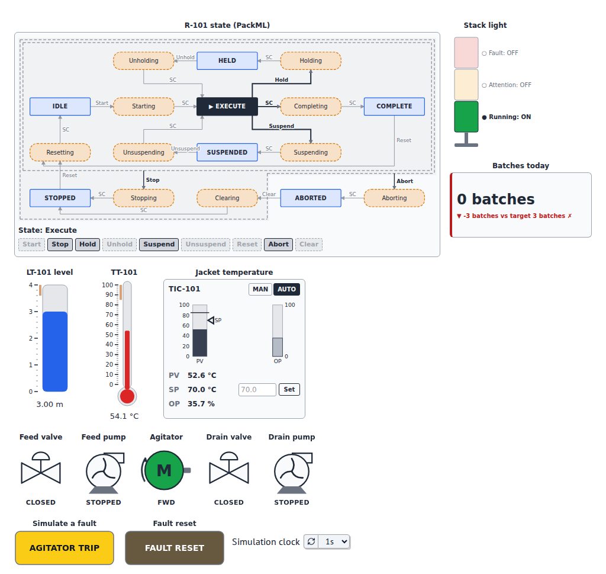

# anywidget-instruments-industrial

Instrumentation widgets for computational notebooks: knobs, gauges,
meters, tanks, LEDs, switches with mechanical actions, emergency stop,
strip charts, spectrograms, logic analyzers, polar and Smith charts, and
SCADA objects (valves, pumps, motors, pipes, alarm banner, synoptic).

Part of the [anywidget instruments family](https://anywidgetinstruments.github.io/):
the core, the industrial, automotive and aeronautics widget libraries, their
hosts (Python, Julia, Grafana) and their live demos.

Built on [anywidget](https://anywidget.dev), the widgets run in **JupyterLab,
Jupyter Notebook 7 and marimo** (tested) and in the other anywidget hosts
such as VS Code and Google Colab, with no JavaScript toolchain and no network
access at runtime. Their front ends also run in
[KaimonSlate.jl](https://github.com/kahliburke/KaimonSlate.jl), a Julia
notebook (see [Hosts](hosts.md)).

!!! example "Showcase: a batch reactor operator station"
    A complete operator station on a simulated batch reactor: PackML state
    machine, recipe, PID faceplate, alarms, trends, event log and plant
    model. The same system runs in **marimo**, in **JupyterLite** and, from
    Julia, in **KaimonSlate.jl**.
    <a class="md-button md-button--primary" href="marimo/batch_reactor/">▶ Open it in your browser</a>
    [All three versions](showcase.md){ .md-button }

    [{ width="560" }](showcase.md)


!!! warning "Safety"
    The library is for visualization, teaching, simulation and supervision.
    It is **not a safety-related system**, and the `EmergencyStop` widget is
    not an emergency stop device. Read the [safety notice](safety.md) before
    connecting widgets to real equipment. The industrial standards that
    inspired the widgets are listed in [Standards and references](standards.md);
    the library does not claim conformity with them.

```python
import anywidget_instruments_industrial as ai

gain = ai.Knob(2.5, min=0, max=10, step=0.1, unit="dB", label="Gain")
level = ai.Tank(1.2, max=5, unit="m", lo=0.5, hi=4.5, show_limits=True, label="Level")


@gain.on_change
def _(change):
    level.value = change["new"] / 2


ai.Panel([gain, level])
```

* [Getting started](getting-started.md) — installation and the common API
* [Widget catalog](widgets.md) — every widget with a short example
* [Showcase](showcase.md) — a batch reactor operator station in marimo, JupyterLite and KaimonSlate.jl
* [Examples](examples.md) — PID tuning, tank supervision, signal acquisition
* [API reference](api.md) — generated from the docstrings
* [License and citation](citing.md) — BSD 3-Clause; how to cite the library

## Related projects

| Project | What it is | Documentation |
|---|---|---|
| [anywidget-instruments-industrial](https://github.com/AnywidgetInstruments/anywidget-instruments-industrial) | Instrumentation widgets for notebooks: gauges, tanks, LEDs, switches, charts, alarms, SCADA objects | <https://anywidgetinstruments.github.io/anywidget-instruments-industrial/> |
| [anywidget-instruments-automotive](https://github.com/AnywidgetInstruments/anywidget-instruments-automotive) | Automotive instruments built on anywidget-instruments-industrial | <https://anywidgetinstruments.github.io/anywidget-instruments-automotive/> |
| [afm-host-panel](https://github.com/AnywidgetInstruments/afm-host-panel) | Grafana panel plugin that runs anywidget modules, with both libraries built in | <https://anywidgetinstruments.github.io/afm-host-panel/> |
