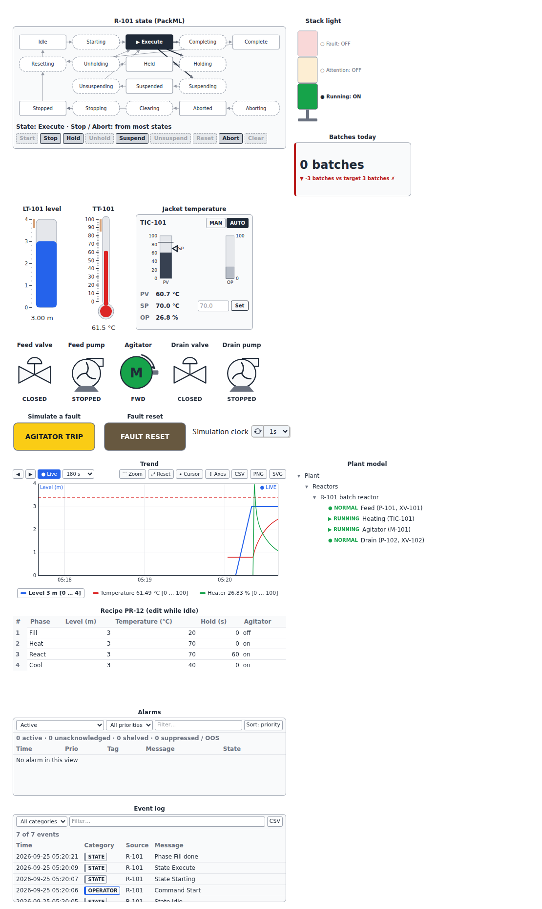

# Showcase: batch reactor R-101

One industrial system of medium complexity, the same on every host: a
jacketed **batch reactor** with its complete operator station. A feed pump
and valve fill it, an agitator stirs it, a PID loop heats the jacket, a drain
pump empties it; a **PackML state machine** runs each batch through the
phases of an editable **recipe**, with alarms, a stack light, trends, an
event log, batch counters and the plant model.

<p>
<a class="md-button md-button--primary" href="../marimo/batch_reactor/">▶ Open in the browser (marimo)</a>
<a class="md-button" href="../lite/lab/index.html?path=batch_reactor.ipynb">▶ Open in JupyterLite</a>
<a class="md-button" href="https://github.com/s-celles/anywidget-instruments/blob/main/examples/kaimonslate/batch_reactor.jl">Julia: KaimonSlate.jl notebook</a>
</p>

The first two run entirely in your browser, with nothing to install (the
first load downloads the Python runtime and takes a few seconds).



!!! note
    The reactor is simulated; the notebooks are not meant to control real
    equipment (see the [safety notice](safety.md)).

## What to try

1. Press **Reset**, then **Start** on the state diagram. The stack light
   turns green; the valves, pumps and agitator follow the phases (Fill, Heat,
   React, Cool, then the drain in Completing); the trend draws the level,
   the temperature and the heater output; the event log records every
   command and state.
2. While the reactor is **Idle** or **Complete**, edit the recipe: the next
   batch uses the new levels, temperatures and hold time. The table checks
   every cell against its limits.
3. Press **AGITATOR TRIP**: an alarm is raised, the batch is held, the
   agitator and the plant model show the fault. Press **FAULT RESET**, then
   **Unhold**.
4. On the faceplate, switch the temperature loop to **MAN** and set the
   output, or change the setpoint in **AUTO**; **Stop** or **Abort** the
   batch at any time.

## One system, three hosts

| Host | Notebook | Who runs the process |
|---|---|---|
| [marimo](https://marimo.io), in the browser or locally | [`lite/marimo/batch_reactor.py`](https://github.com/s-celles/anywidget-instruments/blob/main/lite/marimo/batch_reactor.py) | Python: the widget objects, a marimo refresh clock |
| JupyterLite, JupyterLab, Notebook 7 | [`lite/content/batch_reactor.ipynb`](https://github.com/s-celles/anywidget-instruments/blob/main/lite/content/batch_reactor.ipynb) | Python: the widget objects, an `asyncio` task |
| [KaimonSlate.jl](https://github.com/kahliburke/KaimonSlate.jl) (Julia) | [`examples/kaimonslate/batch_reactor.jl`](https://github.com/s-celles/anywidget-instruments/blob/main/examples/kaimonslate/batch_reactor.jl) | Julia: no Python kernel; the widgets are bound to trait dictionaries |

In Python, the process model reads and writes the widget objects
(`machine.state_complete()`, `tank.value = …`, `trend.add(…)`). In Julia,
the same front-end modules are hosted without a Python kernel, through the
[trait contract](trait-contract.md): Julia writes traits with `set_bind`
and sends the data messages of the trend and the batch counter with
`afm_emit`, while the widgets apply the operator actions themselves
(commands, recipe edits, setpoint and mode changes, alarm acknowledgements)
and Julia reads the results from the bound dictionaries.

### Running the Julia notebook

The notebook needs [KaimonSlate.jl](https://github.com/kahliburke/KaimonSlate.jl)
and its **SlateAFM** extension, which hosts anywidget front-end modules
(it ships in the KaimonSlate.jl repository under
`examples/extensions/SlateAFM`). `pypi_afm` installs the Python package with
the system `pip` to read its front-end module and trait defaults; nothing
Python runs afterwards. Until the package is published, set `AWI_PACKAGE`
to a wheel of it:

```julia
ENV["AWI_PACKAGE"] = "/path/to/anywidget_instruments-0.1.0.dev0-py3-none-any.whl"
```

then open `examples/kaimonslate/batch_reactor.jl` in Kaimon Slate and press
**Run simulation**. The browser side of the notebook (every trait and message
it writes, every operator action it reads) is checked by an end-to-end test
on a host page that reproduces SlateAFM (`e2e/host/reactor.html`); the
Julia code itself is not run by the continuous integration.

## Widgets and references

| Function | Widgets | References |
|---|---|---|
| Machine states and commands | `StateMachine` (PackML model) | ISA-TR88.00.02 |
| Recipe phases | `RecipeTable` | ISA-88 / IEC 61512-1 |
| Temperature control | `PIDFaceplate` with `PID` | ISA-101 |
| Process values | `Tank`, `Thermometer` | |
| Final elements | `Valve`, `Pump`, `Motor` | ISA-5.1 (tags, symbols) |
| Alarms and events | `AlarmList`, `EventLog`, `PushButton` (fault and reset) | ISA-18.2 / IEC 62682 |
| Status at a glance | `StackLight`, `KPITile` | IEC 60073 (stack light colors) |
| History | `TrendChart` | ISA-101 |
| Plant structure | `EquipmentTree` | IEC 62264 |

These standards inspired the widgets; the library does not claim conformity
with them (see [Standards and references](standards.md)).
