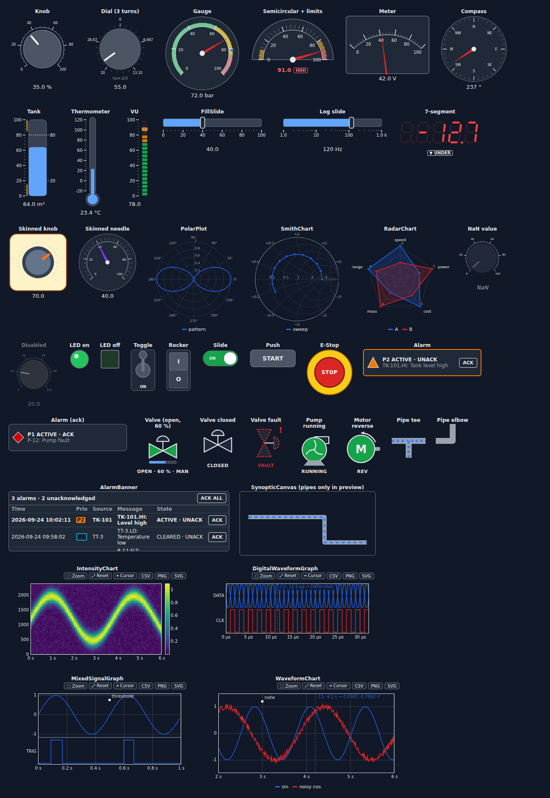
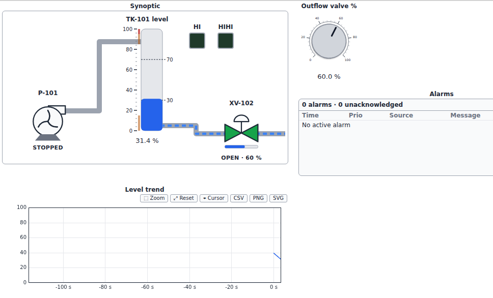
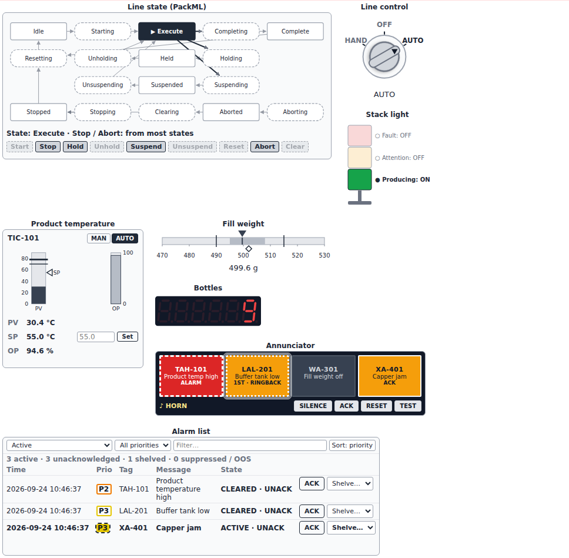

# Widget catalog



## At a glance

Widgets grouped by function. **C** = control by default, **I** = indicator
by default; every widget switches with `mode`.

| Group | Widgets | Standards followed |
|---|---|---|
| Controls, continuous | `Knob` (C), `Dial` (C), `FillSlide` (C), `NumericEntry` (C, keypad); a numeric entry field on every numeric control | |
| Controls, discrete | `PushButton` (C), `ToggleSwitch` (C), `RockerSwitch` (C), `SlideSwitch` (C), `SelectorSwitch` (C), `EmergencyStop` (C) | IEC 60073 (button and lamp colors) |
| Indicators, analog | `Gauge`, `Meter`, `VUMeter`, `Tank`, `Thermometer`, `SevenSegment`, `Compass`, `AnalogIndicator` (I) | ISA-101 (`AnalogIndicator`) |
| Indicators, discrete | `LED`, `StackLight` (I) | IEC 60073 |
| Graphs, time | `WaveformChart`, `IntensityChart`, `DigitalWaveformGraph`, `MixedSignalGraph` (I) | |
| Graphs, trends | `TrendChart`, `Sparkline` (I) | ISA-101 |
| Compact indicators | `DeviationIndicator`, `BarGraph`, `KPITile` (I) | ISA-101, ISO 22400 (`oee`) |
| Graphs, specialized | `PolarPlot`, `SmithChart`, `RadarChart`, `PictureControl` | |
| Alarms and events | `AlarmIndicator`, `AlarmBanner`, `AlarmList`, `Annunciator`, `EventLog` | ISA-18.1, ISA-18.2 / IEC 62682 |
| Process symbols | `Valve`, `Pump`, `Motor`, `Pipe` (faceplates) | ISA-5.1 (symbols) |
| Field instruments | `Transmitter` (I) | ISA-5.1, NAMUR NE 107 |
| Supervisory objects | `PIDFaceplate` with `PID`, `StateMachine` | ISA-101, ISA-TR88.00.02 |
| Layout and session | `Panel`, `SynopticCanvas`, `ThemeSwitch` | |

The sections below follow the families of the [specification](specification.md).
The standards named in this page inspired the widgets; the library does not
claim conformity with them (see [Standards and references](standards.md)).

## Numeric controls and indicators

| Widget | Default mode | Notes |
|---|---|---|
| `Knob` | control | `angle_range` |
| `Dial` | control | `turns` for multi-turn operation |
| `Gauge` | indicator | `variant="circular"/"semicircular"`, colored `ranges`, `peak_hold` |
| `Meter` | indicator | sector scale, `peak_hold` |
| `VUMeter` | indicator | `segments`, `peak_hold`, `peak_decay` |
| `Tank` | indicator | `markers`, `fill_color` |
| `Thermometer` | indicator | bulb and fluid column |
| `FillSlide` | control | `orientation` horizontal / vertical |
| `SevenSegment` | indicator | `digits`, `decimals`, `color` |
| `Compass` | indicator | heading in degrees |

## Boolean controls and indicators

`LED` (round/square, `blink`), `ToggleSwitch`, `RockerSwitch`,
`SlideSwitch`, `PushButton`, `EmergencyStop` (latches, `reset()`), all with
`mechanical_action`, `confirm` (two-step confirmation) and `latch_timeout`.

`PushButton` takes a cap `color` (`BUTTON_COLORS`) and `shape="round"` for a
panel operator. An illuminated push button has a built-in lamp: `lamp=True`
or `False` (lit or not, `None` for no lamp), `lamp_color` (`LAMP_COLORS`)
and `lamp_blink`. The program drives the lamp, independently of the button
value (BOOL-015):

```python
start = ai.PushButton(text="START", shape="round", color="green")
running = ai.PushButton(text="RUN", shape="round", lamp=False, lamp_color="green")
start.observe(lambda ch: setattr(running, "lamp", True) if ch["new"] else None, "value")
```

## Graphs

All graphs share cursors (`add_cursor`, `cursor_values`), annotations
(`annotate`), zoom (toolbar, wheel, double-click reset) and export
(CSV / PNG / SVG).

```python
chart = ai.WaveformChart(
    n_traces=2, history=2000, dt=1e-3, x_unit="s", update_mode="strip", autoscale_y=True
)
chart.append(samples)  # (n_points, n_traces), sent as binary float32

spec = ai.IntensityChart(n_bins=256, y_max=fs / 2, colormap="inferno")
spec.append(np.abs(np.fft.rfft(block))[:256])

logic = ai.DigitalWaveformGraph(buses=[{"name": "DATA", "lines": [7, 6, 5, 4, 3, 2, 1, 0]}])
logic.set_data(bytes_read, n_bits=8)

mixed = ai.MixedSignalGraph(dt=1e-6)
mixed.set_analog(v)
mixed.set_data(trigger)
```

## Specialized displays

```python
polar = ai.PolarPlot(zero="N", direction="cw")
polar.plot(gain_db, angles_deg, name="pattern")

smith = ai.SmithChart(z0=50)
smith.plot(impedances, name="S11")  # complex ohms, or kind="reflection"

radar = ai.RadarChart(axes=["speed", "power", "cost"])
radar.plot([4, 3, 5], name="A")

pic = ai.PictureControl(size=(320, 200))
pic.rect(10, 10, 100, 50, fill="#3b82f6").text(20, 40, "hello").flush()
pic.on_click(lambda e: print(e["x"], e["y"]))
```

## Supervisory objects

`Valve`, `Pump`, `Motor` (state feedback, faceplate commands with
`on_command`, `auto`/manual, optional `simulate`), `Pipe` segments,
`AlarmIndicator`, `AlarmBanner` and `SynopticCanvas`, which places widgets and
animated pipe runs on a background image.



## Industrial operator objects

!!! warning
    These objects present and simulate operator functions; they do not
    implement safety functions. See the [safety notice](safety.md).

Objects for control rooms and machine panels (IND-001 .. IND-063). They follow
ISA-101 (grey scale in normal operation, color for abnormal situations),
ISA-18.1 (annunciator sequences), ISA-18.2 / IEC 62682 (alarm management),
IEC 60073 (indicator colors) and ISA-TR88.00.02 (machine state model).

```python
import anywidget_instruments as ai

# high-performance bar: normal band, limits and target; color only in alarm
weight = ai.AnalogIndicator(
    502, min=470, max=530, unit="g", normal_lo=495, normal_hi=508, target=502, lo=490, hi=515
)

# selector and key switch
mode = ai.SelectorSwitch("AUTO", positions=["HAND", "OFF", "AUTO"])
access = ai.SelectorSwitch("LOCAL", positions=["LOCAL", "REMOTE"], keyed=True, locked=True)

# signal tower
light = ai.StackLight(tiers=["red", "amber", "green"], labels=["Fault", "Attention", "Run"])
light.set("green", "on")

# control loop: PID controller and its faceplate
loop = ai.PIDFaceplate(
    tag="TIC-101",
    unit="°C",
    pv_max=150,
    confirm_delta=10,
    controller=ai.PID(kp=2.0, ti=30.0, sp=75.0),
)
op = loop.step(pv=72.4, dt=0.5)  # call with each new measurement

# annunciator (ISA-18.1 sequence A, M or R, first out)
ann = ai.Annunciator(
    [("PAH-101", "Pressure high", "red"), ("LAL-201", "Level low")], sequence="R", first_out=True
)
ann.set("PAH-101", True)

# alarm summary with shelving, suppression and out-of-service states
alarms = ai.AlarmList()
alarms.raise_alarm("TI-101.HI", "Temperature high", source="TI-101", priority="high")
alarms.on_event(lambda e: print(e["name"], e["alarm_id"]))

# machine state model (PackML by default)
machine = ai.StateMachine()
machine.command("Reset")
machine.state_complete()  # the kernel ends acting states
```

| Widget | Operator actions sent to the kernel |
|---|---|
| `SelectorSwitch` | position (rejected while a key switch is locked) |
| `PIDFaceplate` | loop mode; SP in AUTO, OP in MAN, with confirmation of large changes |
| `Annunciator` | Silence, Acknowledge, Reset, Test (while held) |
| `AlarmList` | Acknowledge, Shelve (timed), Unshelve |
| `StateMachine` | commands valid in the current state |



## Trends, instruments and compact indicators

Objects of supervision screens (IND-070 .. IND-104).

### TrendChart

Named pens against wall-clock time, each on its own scale; the vertical axis
shows the scale of the selected pen (click its legend entry). Alarm limits
are dashed lines and the setpoint a dotted line. The chart follows the latest
data (● LIVE); the ◀ ▶ buttons, the zoom and the span list browse the
history (❚❚ HISTORY) until **● Live** is pressed. Times are Unix seconds and
travel as binary float64; cursors and axis fields take local times
(`HH:MM:SS` or `YYYY-MM-DD HH:MM:SS`).

```python
trend = ai.TrendChart(
    pens=[
        {"name": "LT-101", "unit": "m", "min": 0, "max": 4, "hi": 3.0, "setpoint": 2.2},
        {"name": "FT-101", "unit": "L/s", "min": 0, "max": 60},
    ],
    span=600,  # seconds shown in live mode
)
trend.add("LT-101", 2.31)  # now
trend.add_many({"LT-101": 2.32, "FT-101": 24.0})
trend.add("FT-101", values, time=timestamps)  # arrays
times, values = trend.data("LT-101")
```

### Transmitter

An instrument bubble in the manner of ISA-5.1 (function letters above the
line, loop number below), with the value, and the device status after the
NAMUR NE 107 categories, each with its own symbol and text: `ok`,
`failure` (✕, the value shows **✕ BAD**), `check` (▲ function check),
`out_of_spec` (? out of specification) and `maintenance` (◆ maintenance
required). Alarm limits work as on the other numeric widgets.

```python
lt = ai.Transmitter(2.41, tag="LT-101", unit="m", max=4, hi=3.0, hihi=3.5)
lt.status = "maintenance"
lt.status_text = "sensor drift"
if lt.valid:  # False while the status is "failure"
    level = lt.value
```

### EventLog

A journal of events, newest first, with time, category (`operator`,
`state`, `alarm`, `system`, shown as text chips), source and message; the
operator filters it by category and text and downloads it as CSV. At most
`max_events` events are kept. `connect()` records every change of the named
traits of other widgets: an audit trail of operator actions.

```python
log = ai.EventLog(max_events=1000)
log.log("Pump P-101 started", source="P-101", category="state")
log.connect(setpoint, category="operator")  # "value: 2.2 → 2.4"
log.connect(pump_mode, category="operator", source="Pump mode")
log.events  # list of dicts, oldest first
```

### DeviationIndicator

A centre-zero bar of the deviation between a value and its setpoint, over
`±span`. The tolerance band `±tolerance` is shaded; inside it the bar is
grey, outside it the bar takes the alarm color and reads **▲ HIGH** or
**▼ LOW**. The signed deviation is written next to the bar.

```python
dev = ai.DeviationIndicator(52.3, setpoint=50, tolerance=1.5, span=5, unit="°C")
dev.deviation, dev.out_of_tolerance  # (2.3, True)
```

### Sparkline

A small trend without axes of the last `history` values, with the last
value written next to it and the minimum (hollow dot) and maximum (filled
dot) marked. Values travel as binary buffers.

```python
spark = ai.Sparkline(history=60, unit="m", format="%.2f")
spark.append(2.31)  # one value
spark.append(level_array)  # or many
```

### BarGraph

Aligned bars on a shared scale, one per `bars` entry (a label, or a dict
with `label`, `normal_lo`, `normal_hi`, `lolo`, `lo`, `hi`, `hihi`). Bars are
grey with the normal band shaded and the limits marked; a bar in alarm is
drawn in the alarm color and labelled with its level. `alarm_levels` gives
the level of each bar.

```python
zones = ai.BarGraph(bars=["Z1", "Z2", {"label": "Z3", "hi": 80}], unit="°C", max=100)
zones.value = [62.0, 64.5, 83.1]
zones.alarm_levels  # ['normal', 'normal', 'hi']
```

### KPITile

A key performance indicator: the value, the target and the difference to
the target with its direction (▲ / ▼) and whether it is on the good side
(✓ / ✗, after `higher_is_better`), with an optional sparkline of the last
`history` values. `oee(availability, performance, quality)` computes the
overall equipment effectiveness in the manner of ISO 22400.

```python
tile = ai.KPITile(unit="%", target=85, label="OEE")
tile.append(ai.oee(0.9, 0.95, 0.99) * 100)  # 84.6 %, "▼ -0.4 % vs target 85.0 % ✗"
```

### NumericEntry

A numeric keypad with a display, for touch panels. The operator types a
value on the keys or the keyboard (digits, `.`, `-`, Backspace, Delete);
Enter commits it after the range check of the numeric controls, Escape
discards it. With `confirm_delta`, a change larger than that asks for a
second Enter.

```python
sp = ai.NumericEntry(2.2, min=0, max=4, unit="m", label="Level setpoint", confirm_delta=0.5)
```
